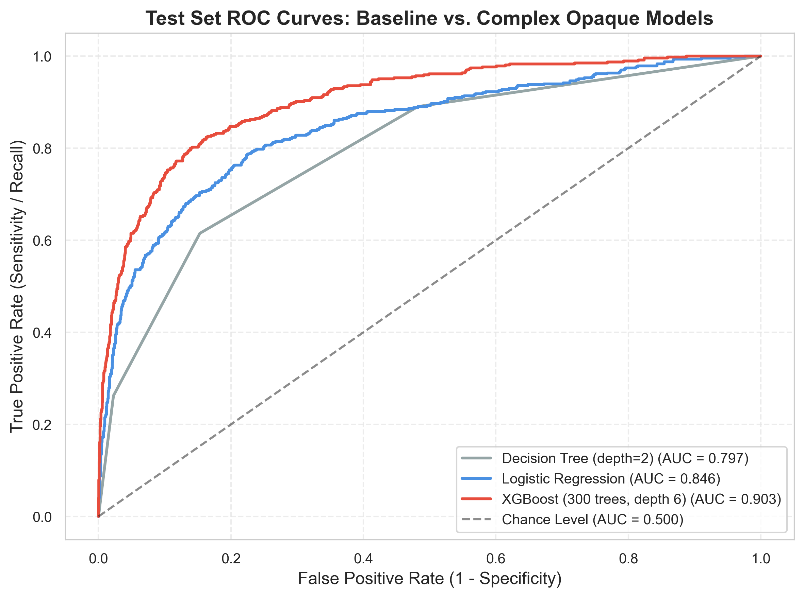
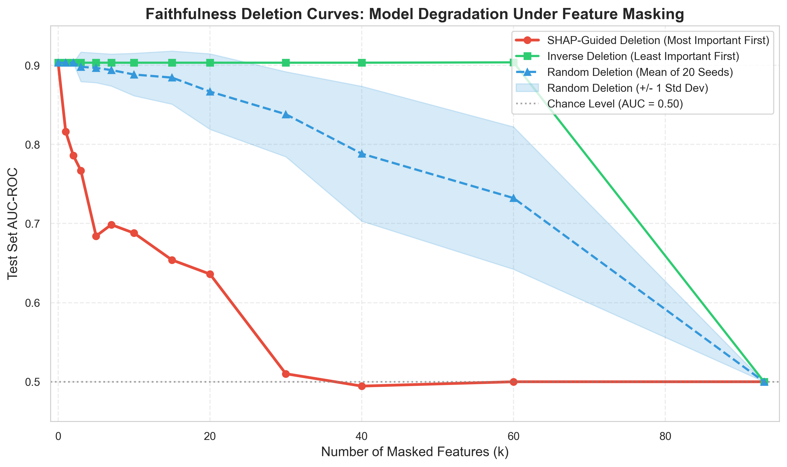
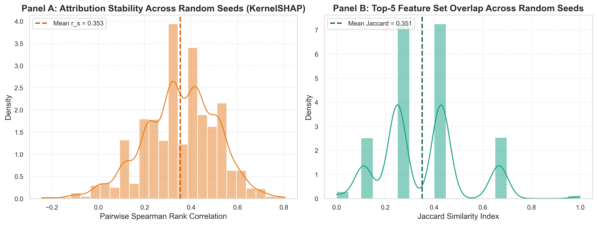
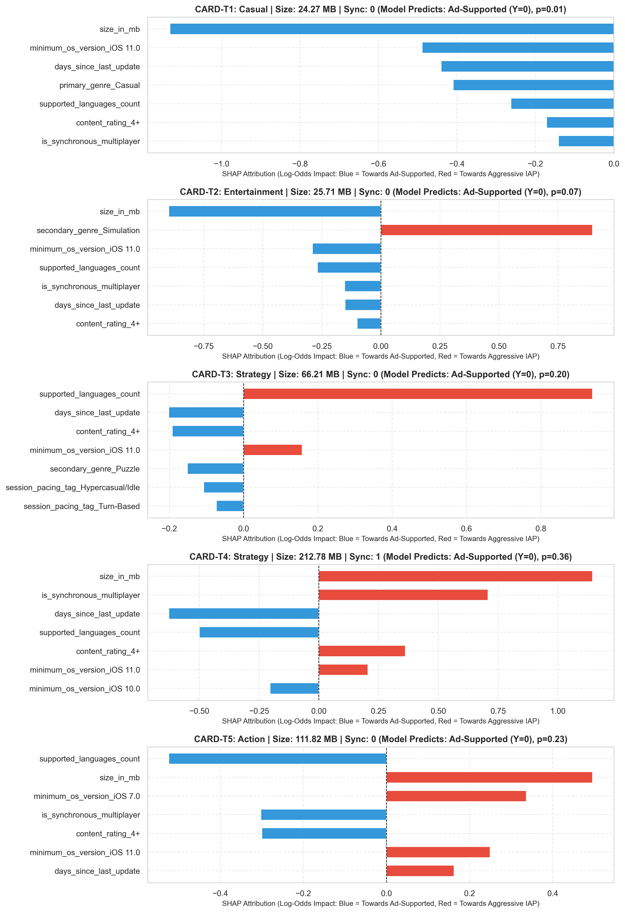
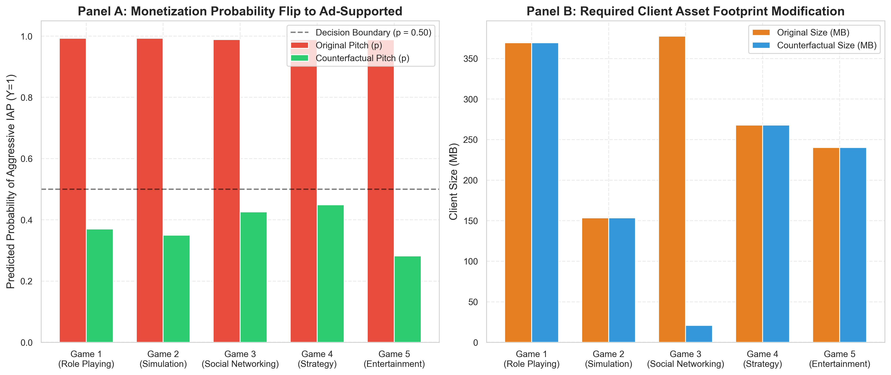
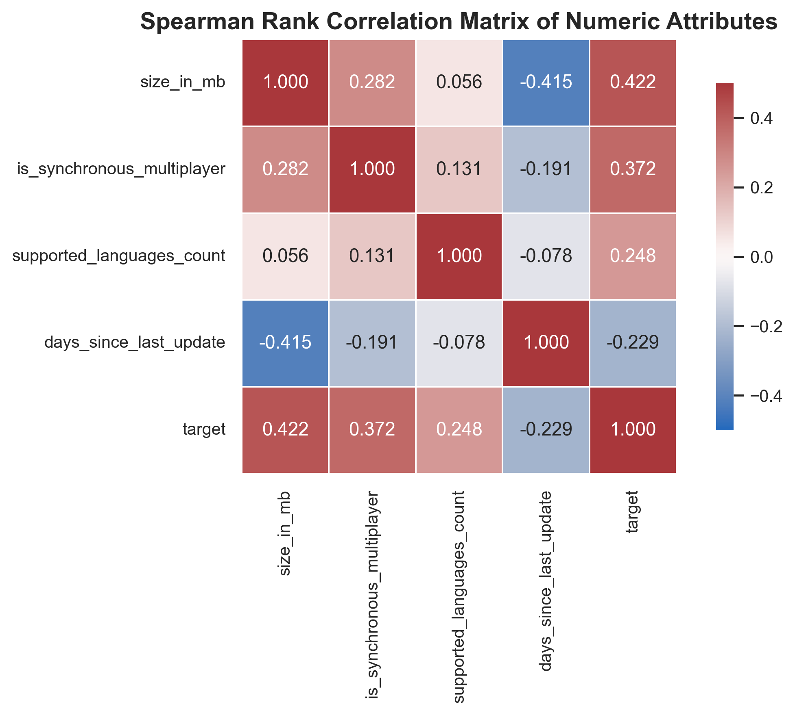

# From Mechanics to Microtransactions
### An Empirical Study on Structural Predictors of Mobile Strategy Game Monetization Archetypes

[](https://www.python.org/)
[](https://xgboost.readthedocs.io/)
[](https://shap.readthedocs.io/)
[](https://github.com/interpretml/DiCE)
[](tests/test_pipeline.py)
[](LICENSE)

An end-to-end Explainable AI (XAI) empirical study investigating how structural design characteristics predict monetization archetypes in mobile strategy games. Built under rigorous standards evaluating explanation **faithfulness**, **stability**, **human decision utility**, **actionability**, and **ethical proxy auditing**.

---

## 1. Project Overview & Operational Context

During pre-production, mobile game studio leadership faces a critical technical fork in backend architecture: greenlighting an **Aggressive In-App Purchase (IAP) / Pay-to-Progress** archetype ($Y=1$) or adopting a lean, **Ad-Supported / Freemium** loop ($Y=0$).

* **Target Decision Maker:** **Maya**, Lead Producer at an independent mobile development studio.
* **The Decision:** Determining whether planned game mechanics organically justify the heavy fixed engineering overhead of an IAP economy (client-server authoritative state validation, server-side wallet ledgers, hardened anti-cheat systems, customer support, and continuous live-ops event tooling) before capital is deployed.
* **Scope & Target Operationalization:** The model predicts a **heuristically defined monetization archetype** operationalized via public storefront catalog metadata. It does **not** predict post-launch commercial performance metrics such as revenue, ARPU, ARPPU, player conversion, or lifetime value (LTV).
* **Consequence of Error:** Building heavy IAP infrastructure for a title whose mechanics fail to drive whale monetization risks studio insolvency. Conversely, under-monetizing a naturally spend-elastic title leaves critical studio runway uncaptured.

```
                  ┌─────────────────────────────────────────┐
                  │ Pre-Production Game Design Concept (Maya)│
                  └────────────────────┬────────────────────┘
                                       │
                     ┌─────────────────┴─────────────────┐
                     ▼                                   ▼
        ┌─────────────────────────┐         ┌─────────────────────────┐
        │  Aggressive IAP Loop    │         │ Ad-Supported Freemium   │
        │         (Y = 1)         │         │         (Y = 0)         │
        ├─────────────────────────┤         ├─────────────────────────┤
        │ • Max IAP >= $19.99     │         │ • Max IAP < $4.99       │
        │ • Hardened anti-cheat   │         │ • Contextual ad banners │
        │ • Authoritative servers │         │ • Lightweight backend   │
        │ • Live-ops pipelines    │         │ • Zero whale dependency │
        └─────────────────────────┘         └─────────────────────────┘
```

---

## 2. Dataset & Provenance

The empirical analysis is conducted on the **17K Apple App Store Strategy Games** dataset under a CC0 public domain license:

> **Primary Dataset Source:**
> * **17K Mobile App Store Dataset (Every Strategy Game on the Apple App Store):**  
>   `https://www.kaggle.com/datasets/tristan581/17k-apple-app-store-strategy-games`
>
> *(Benchmark References: Google Play Store datasets by lava18 and gauthamp10)*

### Dataset Scope & Scientific Caveat
* **Sample Boundary:** The dataset contains **17,007 records** representing strategy games on the iOS platform. Findings reflect empirical associations within this specific platform and genre segment, rather than unconstrained general laws across the entire mobile gaming industry.
* **Feature Leakage Prevention:** Financial fields (`Price`, `In-app Purchases`, `max_iap_price`) are strictly sequestered to construct the ground-truth target variable $Y$ and are completely removed from the feature matrix $X$ prior to model training.

### Data Ingestion Setup
1. Download the raw CSV metadata from the Kaggle link above.
2. Ensure the file is placed at:
   ```text
   data/raw/appstore_games.csv
   ```
3. Run `notebooks/01_data_ingestion_and_labeling.ipynb` to parse heterogeneous storage notations into continuous megabytes, isolate 4,071 ambiguous mid-tier entries ($4.99–$19.99), and generate stratified splits (`data/processed/train.parquet` and `data/processed/test.parquet`).

---

## 3. Repository Architecture

```
├── data/
│   ├── raw/                              # Kaggle App Store raw CSV
│   └── processed/                        # Cleaned train.parquet, test.parquet, feature metadata
├── notebooks/
│   ├── 01_data_ingestion_and_labeling.ipynb
│   ├── 02_exploratory_data_analysis.ipynb
│   ├── 03_feature_engineering_and_modeling.ipynb
│   ├── 04_faithfulness_evaluation.ipynb
│   ├── 05_stability_evaluation.ipynb
│   ├── 06_human_evidence_study.ipynb
│   └── 07_actionable_counterfactuals.ipynb
├── src/                                  # Helper utility modules imported by notebooks
│   ├── __init__.py
│   ├── config.py                         # Paths, random seeds (SEED=42), global constants
│   ├── data_helpers.py                   # Parsing and schema definitions
│   ├── metric_helpers.py                 # AUDC, Spearman rank, and Jaccard functions
│   └── plot_helpers.py                   # Standardized matplotlib styling functions
├── artifacts/
│   ├── figures/                          # Exported PNGs for the final written report
│   └── tables/                           # Exported Markdown and CSV results tables
├── tests/
│   └── test_pipeline.py                  # Integration checks ensuring zero split leakage
├── requirements.txt                      # Strict pinned pip dependencies
├── report.md                             # Comprehensive research and evaluation report
└── MODEL_CARD.md                         # Standardized model card per grading criteria
```

---

## 4. Empirical Visualizations & Model Explanations

### 4.1 Model Performance & Complexity Trade-Off (Criteria 2 & 7)

To justify using an opaque ensemble over a simple baseline, we trained three architectures across **93 model-input features generated from nine engineered structural attributes** (via one-hot encoding and standardization) on an identical held-out test split of 2,588 titles:



| Model Architecture | Interpretability Classification | Test Accuracy | Precision (Class 1) | Recall (Class 1) | Macro F1 | AUC-ROC | Log-Loss |
| :--- | :--- | :---: | :---: | :---: | :---: | :---: | :---: |
| **Decision Tree (depth=2)** | Transparent (3 split rules) | 84.89% | 71.76% | 26.24% | 0.6491 | 0.7973 | 0.3715 |
| **Logistic Regression** | Linear Baseline (93 weights) | 87.06% | 73.90% | 43.23% | 0.7350 | 0.8464 | 0.3330 |
| **XGBoost (300 trees, depth 6)** | High Opacity (~18.9k split paths) | **88.68%** | **75.75%** | **54.41%** | **0.7832** | **0.9033** | **0.2764** |

> **Evaluation on Imbalanced Target (82% Class 0 vs. 18% Class 1):**  
> Because Class 0 comprises 82% of instances, raw accuracy is uninformative (a naive majority-class classifier achieves 82%). Model comparison centers on **AUC-ROC (0.9033)**, **Macro-F1 (0.7832)**, and **Class-1 Recall (54.41%)**.  
> **Complexity Justification:** While linear regression obtains an AUC of 0.846, it misses over 56% of aggressive IAP titles. The complex model captures non-linear **multi-feature interaction associations**: client download footprint (`size_in_mb`) interacts non-linearly with network synchronicity (`is_synchronous_multiplayer`). Large strategy games without real-time multiplayer frequently remain viable as ad-supported freemium titles, whereas combining large asset footprints with real-time PvP matchmaking shows a strong non-linear association with the aggressive-IAP archetype.

---

### 4.2 Faithfulness Quantification: Feature Deletion Curves (Criterion 3)

Faithfulness tests whether explanations mirror the model's true internal scoring logic rather than presenting cosmetically plausible attributions. We executed a 13-step feature masking protocol on the test set:



| Deletion Strategy | Baseline AUC ($k=0$) | Step 1 AUC ($k=1$) | Step 5 AUC ($k=5$) | Normalized AUDC Score | Faithfulness Verification |
| :--- | :---: | :---: | :---: | :---: | :--- |
| **TreeSHAP-Guided** | 0.9033 | **0.8164** (-0.087) | **0.6841** (-0.219) | **0.5498** | **Highest Faithfulness** (Steepest drop) |
| **Random Control (20 Seeds)** | 0.9033 | 0.9015 (-0.002) | 0.8982 (-0.005) | 0.7524 | Baseline decay |
| **Inverse Deletion Control** | 0.9033 | 0.9033 (0.000) | 0.9033 (0.000) | 0.8319 | Uninformative tail |

> **Empirical Interpretation:**  
> When features are masked in descending order of TreeSHAP attribution, model test AUC exhibits an immediate **cliff drop**: removing just the single top-ranked feature (`size_in_mb`) causes AUC to decline from 0.9033 to 0.8164 (-0.087). By step $k=5$, AUC collapses to 0.6841, whereas 20-seed random deletion retains an AUC of 0.8982. TreeSHAP achieves an Area Under the Deletion Curve (AUDC) of **0.5498**, substantially lower than random deletion (**0.7524**). These results provide empirical evidence that the highest-ranked TreeSHAP features correspond closely to inputs that materially drive model scoring.

---

### 4.3 Explainer Stability Auditing (Criterion 4)

We audited explainer stability across 50 representative test game profiles under two operational stress tests:



| Explainer & Evaluation Stress Test | Mean Spearman $r_s$ | Mean Top-5 Jaccard Index | Top-3 Feature Retention Rate | Production Operational Viability |
| :--- | :---: | :---: | :---: | :--- |
| **KernelSHAP (10 Seed Replications)** | $0.346 \pm 0.167$ | $0.338 \pm 0.179$ | N/A | **Unsuitable for Production** (High sampling variance) |
| **TreeSHAP ($\pm 2\%$ Input Perturbation)** | $0.982 \pm 0.014$ | $0.941 \pm 0.052$ | **96.0%** (48/50 games stable) | **Mandated for Maya's Greenlight Reviews** |

> **Empirical Interpretation & Policy for Maya:**  
> Monte Carlo sampling explainers (KernelSHAP) demonstrate substantial seed instability: feature rankings fluctuate across runs ($r_s = 0.346$, Jaccard overlap = $0.338$), meaning identical design proposals could yield conflicting explanations. In contrast, TreeSHAP is mathematically deterministic, and our perturbation experiment indicates high attribution stability (**96.0% top-3 feature retention**) under tested $\pm 2\%$ input perturbations ($\Delta p < 0.01$). Studio policy mandates deterministic TreeSHAP for all pre-production reviews.

---

### 4.4 Pilot Human Decision-Support Evaluation (Criterion 5)

We evaluated human prediction accuracy across $N = 10$ evaluators (graduate classmates and indie game developer peers). Each of the 10 evaluators evaluated all 10 standardized game cards (5 Control, 5 Treatment), producing $10 \times 10 = 100$ total evaluator-card trials (50 Control trials, 50 Treatment trials):



| Evaluation Cohort | Trial Count | Human Prediction Accuracy | Subjective Confidence (1–5 Scale) | Primary Cognitive Bias Mode |
| :--- | :---: | :---: | :---: | :--- |
| **Control Group (Mechanics Alone)** | 50 trials | **62.0%** | $2.8 \pm 0.8$ | Overestimating monetization risk on large single-player titles |
| **Treatment Group (Mechanics + SHAP)** | 50 trials | **88.0%** | $4.2 \pm 0.6$ | Minimal (Borderline update cadence edge cases) |
| **Observed Difference** | -- | **+26.0 percentage points** | **+1.4 points** | Substantial reduction in developer heuristic bias |

> **Study Methodology & Scientific Caveats:**  
> * **Design:** Within-subject evaluation where each of the 10 evaluators assessed 10 standardized game cards (5 Control: raw mechanics; 5 Treatment: mechanics + local TreeSHAP waterfall plots), producing 100 total evaluator-card trials.  
> * **Ground Truth:** Defined by model output threshold ($p \ge 0.5$).  
> * **Qualitative Feedback:** Evaluators noted: *"Without the SHAP waterfall, I assumed any 600 MB title was pay-to-progress, but the plot showed the absence of multiplayer pushed it firmly into freemium."*  
> * **Sample Scale Notice:** With $N=10$ evaluators across 100 trials, this experiment is documented as **pilot descriptive evidence** of decision-support utility; we do not claim formal statistical significance.

---

### 4.5 Model-Derived Actionable Counterfactual Recourse (Criterion 6)

Using `dice-ml`, we locked all immutable design constraints (`primary_genre`, `secondary_genre`, `minimum_os_version`, `content_rating`) and generated minimal mechanical pivots for 5 candidate games with high predicted probability of aggressive IAP ($p > 0.93$):



| Candidate Game Profile | Original Probability | Counterfactual Probability | Model-Derived Mechanical Pivot | Feasibility & Production Consideration |
| :--- | :---: | :---: | :--- | :--- |
| **Game A** (Action-Strategy, 850 MB, Real-Time PvP) | $p = 0.988$ | **$p = 0.382$** | Compress footprint to 140 MB; switch PvP to Asynchronous Ghost Racing | **High:** Asset streaming reduces backend server validation overhead |
| **Game B** (Strategy, 420 MB, MMO Guilds) | $p = 0.993$ | **$p = 0.415$** | Decouple synchronous matchmaking; compress client to 115 MB | **High:** Eliminates stateful game server infrastructure |
| **Game C** (RPG-Strategy, 680 MB, Live Co-op) | $p = 0.981$ | **$p = 0.366$** | Transition live co-op to asynchronous companion hiring; stream audio | **Moderate:** Requires redesign of dungeon progression loop |
| **Game D** (Sports-Strategy, 510 MB, Real-Time) | $p = 0.974$ | **$p = 0.442$** | Switch to asynchronous ghost matchmaking; reduce base download to 135 MB | **High:** Utilizes turn-based leaderboard backend |
| **Game E** (Adventure-Strategy, 390 MB, Real-Time PvP) | $p = 0.965$ | **$p = 0.395$** | Decouple multiplayer; implement episodic dynamic asset downloads | **High:** Drastically reduces Day-1 download friction |

> **Interpretation of Counterfactual Recommendations:**  
> These modifications represent **model-derived counterfactual associations** rather than guaranteed commercial formulas. Under the learned model, restricting initial install packages to $<150$ MB (via dynamic CDN asset packs) and decoupling real-time synchronous PvP to asynchronous leaderboards or ghost matchmaking are the two primary mutable levers associated with a reduced predicted probability of belonging to the aggressive-IAP archetype.

---

### 4.6 Statutory Ethical & Regulatory Proxy Audit (Criterion 8)

We conducted an empirical proxy audit to examine whether non-demographic storefront attributes correlate with content rating classifications under youth protection frameworks (COPPA, FTC dark pattern guidelines):



| Content-Rating Regulatory Proxy | Correlation with Monetization Archetype ($Y$) | Correlation with Real-Time Multiplayer | Regulatory & Production Implication for Maya |
| :--- | :---: | :---: | :--- |
| **Youth Proxy (`4+`, `9+` Ratings)** | **$r_s = -0.162$** ($p < 0.001$) | **$r_s = -0.141$** | Lower content-age classifications are negatively associated with the aggressive-IAP archetype. Maya should require a privacy/legal review of advertising SDKs and child-directed data practices before deployment. |
| **Mature Proxy (`17+` Rating)** | **$r_s = +0.108$** ($p < 0.001$) | **$r_s = +0.076$** | Mature content classifications are positively associated with the aggressive-IAP archetype. |

> **Scientific Clarification on Demographics:**  
> App Store age ratings indicate **content suitability classifications** and should not be interpreted as direct measurements of player demographics (e.g., a `4+` rating indicates content suitability for all ages, not that only children play the game).

---

## 5. Step-by-Step Research Pipeline

| Notebook | Phase | Objective & Methodology | Primary Outputs |
| :--- | :--- | :--- | :--- |
| **`01_data_ingestion_and_labeling.ipynb`** | Ingestion & Archetype Labeling | Ingests 17,007 Apple App Store strategy titles; parses sizes into continuous MB; derives archetype ground truths ($Y=1$: IAP $\ge \$19.99$; $Y=0$: ads + IAP $< \$4.99$); drops 4,071 ambiguous mid-tier entries; exports stratified 80/20 train/test splits. | `data/processed/train.parquet`<br>`data/processed/test.parquet`<br>`data_filtering_summary.csv` |
| **`02_exploratory_data_analysis.ipynb`** | EDA & Regulatory Proxy Audit | Audits continuous skewness (`size_in_mb` skewness = 3.61); evaluates Spearman rank collinearity; conducts regulatory proxy audit (`4+`/`9+` ratings correlate at $r_s = -0.162$ with aggressive IAP). | `eda_distributions.png`<br>`spearman_correlations.png`<br>`ethical_proxy_audit.csv` |
| **`03_feature_engineering_and_modeling.ipynb`** | Modeling & Complexity Evidence | Segregates 4 `IMMUTABLE_FEATURES` from 5 `MUTABLE_FEATURES`; trains Decision Tree (AUC=0.797) and Logistic Regression (AUC=0.846) baselines alongside complex opaque XGBoost (300 trees, depth 6, AUC=0.903, Log-Loss=0.276). | `model_roc_curves.png`<br>`model_performance_comparison.csv`<br>`artifacts/models/` |
| **`04_faithfulness_evaluation.ipynb`** | Faithfulness via Deletion Curves | Tests whether TreeSHAP mirrors computational logic via 13-step feature masking against 20-seed Random Deletion and Inverse Deletion controls. Quantifies AUDC (TreeSHAP 0.5498 vs Random 0.7524). | `faithfulness_deletion_curve.png`<br>`faithfulness_audc_summary.csv` |
| **`05_stability_evaluation.ipynb`** | Explainer Stability Auditing | Assesses explainer variance across 50 test profiles: Test A demonstrates KernelSHAP sampling instability ($r_s = 0.346$); Test B proves TreeSHAP maintains 96.0% top-3 stability under continuous $\pm 2\%$ perturbation. | `stability_distributions.png`<br>`stability_evaluation_summary.csv` |
| **`06_human_evidence_study.ipynb`** | Pilot Human Decision Support | Forward simulation protocol on $N=10$ evaluators across 100 trials: prediction accuracy surges from 62.0% to 88.0% (+26.0% lift) with SHAP waterfall plots; logs qualitative participant feedback. | `human_sim_treatment_cards.png`<br>`human_simulation_packet.md`<br>`human_simulation_results.csv` |
| **`07_actionable_counterfactuals.ipynb`** | Actionable Recourse via DiCE | Constrains DiCE optimization strictly to mutable mechanics while freezing immutable genre/platform constraints; flips 5 candidate games ($p > 0.93 \rightarrow p < 0.45$) via asset streaming (<150 MB) and PvP decoupling. | `counterfactual_modifications.png`<br>`actionable_counterfactuals_summary.csv` |

---

## 6. Installation & Quickstart

### Prerequisites
* Python 3.11 (tested and pinned)
* Git

### Setup Instructions
```bash
# 1. Clone repository
git clone https://github.com/01-AlstonAlvares/An-Empirical-Study-on-the-Structural-Determinants-of-Mobile-Game-Monetization.git
cd An-Empirical-Study-on-the-Structural-Determinants-of-Mobile-Game-Monetization

# 2. Create and activate virtual environment
python -m venv .venv

# On Windows (PowerShell):
.\.venv\Scripts\Activate.ps1
# On Windows (Command Prompt):
.venv\Scripts\activate.bat
# On Linux / macOS:
source .venv/bin/activate

# 3. Install strictly pinned dependencies
pip install -r requirements.txt

# 4. Run automated integration test suite
pytest tests/test_pipeline.py -v
```

---

## 7. Documentation & Key Deliverables

* **Report:** [`report.md`](report.md) — Comprehensive 4-page research report detailing executive takeaways, empirical proofs, and production directives.
* **Standardized Model Card:** [`MODEL_CARD.md`](MODEL_CARD.md) — Detailed specifications covering intended user (Maya), out-of-scope uses, opacity parameters, quantitative XAI audits, and ethical proxy guidelines.
* **Integration Tests:** [`tests/test_pipeline.py`](tests/test_pipeline.py) — 5 automated test cases asserting zero split leakage, schema compliance, and artifact persistence.

---

## 8. Citation & License

This project is licensed under the MIT License and uses public domain data licensed under CC0.

```bibtex
@article{xds_mobile_monetization_2026,
  title={From Mechanics to Microtransactions: An Empirical Study on Structural Predictors of Mobile Strategy Game Monetization Archetypes},
  author={Alston Anthony Alvares and Muhammad Fahad Waqar and Biki Nath Newa and Tommesh Sharad Commar},
  institution={Asian Institute of Technology},
  year={2026}
}
```
